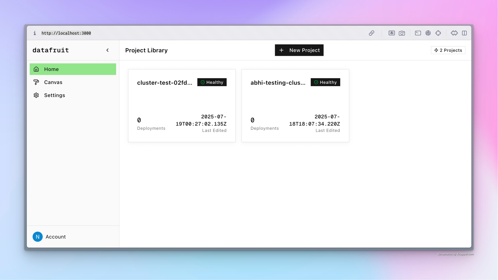

  <picture>
    <source media="(prefers-color-scheme: dark)" srcset="https://github.com/datafruit-dev/datafruit/blob/main/docs/logodark.svg?raw=true">
    <source media="(prefers-color-scheme: light)" srcset="https://github.com/datafruit-dev/datafruit/blob/main/docs/logolight.svg?raw=true">
    
  </picture>

Self-hosted platform that lets users deploy applications and databases to their **own AWS accounts** in a scaleable way using **the power of kubernetes**. It gives you full control over your own deployments.
---

## 🚀 What It Does

- **Own Your Infrastructure**: Every project runs on its own EKS cluster in the user’s AWS account.
- **One-Click Deployments**: Connect a GitHub repo, and Datafruit handles the rest — build, push, and deploy.
- **PostgreSQL-as-a-Service**: Users can provision and manage databases as first-class resources.
- **Managed Kubernetes**: Apps and databases are deployed as Kubernetes services on EKS.
- **Internal Control Plane**: Tracks all builds, clusters, apps, and databases for easy management.

---

## ⚙️ How It Works

1. **Connect GitHub Repo**: Provide a repository URL.
2. **Smart Build Plan**: Datafruit analyzes the codebase with `railpack`.
3. **Docker Build & Push**: Image is built with Docker Buildx and pushed to the user's ECR.
4. **Kubernetes Deploy**: The app and any requested databases are deployed on EKS.
5. **Dashboard & API**: Track deployments and infrastructure status from the UI or API.

---

## 🧩 Why Use Datafruit?

- Full AWS ownership
- Per-project isolation via dedicated EKS clusters
- No vendor lock-in
- GitHub to production in minutes

---

## 🛠 Status

> This project is actively developed and not yet production-ready. Contributions welcome!

